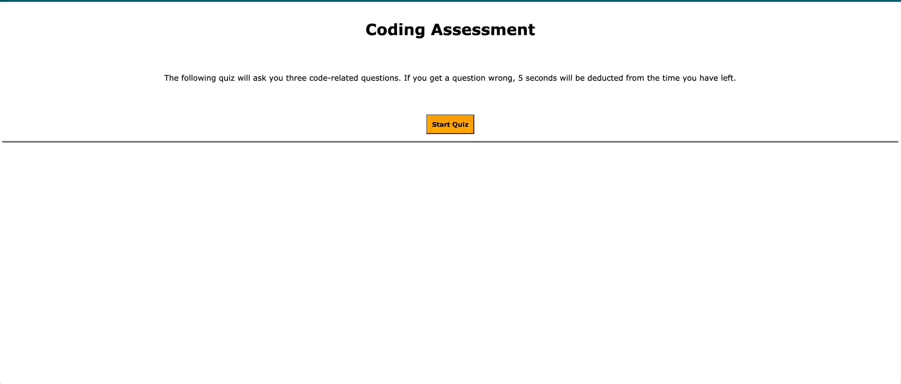

# Coding Assessment

## Summary of Project

The following project entailed creating a [practice coding assessment](https://lilyannekot.github.io/coding-quiz/) containing a few multiple-choice questions. Though you have one minute to answer all of the questions, each incorrect answers leads to a penalty of 5 seconds removed from your time left. Once all questions have been answered or the timer reaches 0, the user is able to save their initial through a prompt and all previous scores are presented on the screen. 

## Technologies and Languages Used

* HTML
* CSS
* JavaScript
* Git

## Project Video



## Code Snippet

The code presented below is used to hide and show elements once the "Start Quiz" button has been pressed by the user. Questions, answer options, and the timer are hidden until the quiz begins. As soon as the quiz begins, the "Start Quiz" button and introduction paragraph are hidden. The list of all previous scores is also hidden until the very end of the quiz when the user inserts their initials.

```
function startQuiz() {
    console.log("Quiz has started");
    startBtn.classList.add("hide");
    questionContainerEl.classList.remove("hide");
    document.querySelector('.intro').classList.add("hide");
    scoreList.classList.remove("hide");

    countdown();
    setNextQuestion();
} 
```

## Author Links

* [GitHub](https://github.com/lilyannekot)
* [Project Website](https://lilyannekot.github.io/coding-quiz/)
* [LinkedIn](https://www.linkedin.com/in/lilykot/)